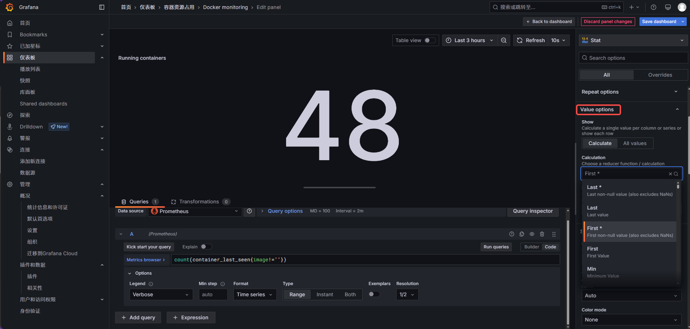

# Grafana 看板「容器数量显示小数」修复方法

> 环境：`http://10.12.7.250:3300`　Grafana 11.6.5
> 看板：`Docker monitoring` → 面板 `Running containers`

---

## 一、问题现象

`Running containers` 面板显示 `48.7` 这类**小数**，而实际容器数是整数（如 `49`）。

## 二、根本原因

| 环节 | 内容 |
|------|------|
| 查询 | `count(container_last_seen{image!=""})` → 返回**整数** |
| Query options | Type = **Range**（取时间范围内的序列） |
| Value options | Calculation = **Mean**（平均值） |
| 结果 | 3 小时窗口内 48/49 波动 → 平均 = `48.7` |

> **修复 = 把 Calculation 从 `Mean` 改成 `Last *`（当前值）**

---

## 方式一：页面点击（Grafana UI）

**路径**：看板 → 面板 → Edit → 右侧 **Value options → Calculation → `Last *`**



### 操作步骤

1. 打开 Grafana → 进入 `Docker monitoring` 看板
2. 鼠标移到 **Running containers** 面板上 → 面板标题出现操作条 → 点 **Edit**（或按快捷键 `E`）
3. 右侧配置栏找到 **Value options**
4. 展开 **Calculation** 下拉，把当前值从 `Mean` 改选为 **`Last *`**
5. 右上角点 **Save**（或 `Ctrl + S`）保存

### Calculation 下拉选项说明

| 选项 | 含义 | 是否解决小数 |
|------|------|------------|
| **Last \*** | 最后一个**非空**值（= 当前值） | ✅ **推荐** |
| Last | 最后一个值（可能为 null） | ✅ |
| First \* | 第一个非空值 | ⚠️ 不是当前值 |
| **Mean** | 平均值 | ❌ **就是它导致小数** |
| Min / Max | 最小 / 最大值 | ⚠️ 不是当前值 |

---

## 方式二：脚本执行（一条命令）

### 脚本位置

| 来源 | 路径 |
|------|------|
| **本仓库**（推荐分发） | [`prometheus/fix-grafana-panel-calcs.sh`](../prometheus/fix-grafana-panel-calcs.sh) |
| 服务器 10.12.7.250 | `/opt/acoinfo/swfactory/prometheus/fix-grafana-panel-calcs.sh` |

从仓库获取脚本（新环境用）：

```bash
curl -fsSLO https://raw.githubusercontent.com/wuyuanji/monitor/main/prometheus/fix-grafana-panel-calcs.sh
chmod +x fix-grafana-panel-calcs.sh
```

### 用法

```bash
# ① 预览（只显示会改什么，不动数据）
GRAFANA_PASS=acoinfo DRY_RUN=1 ./fix-grafana-panel-calcs.sh

# ② 实际执行
GRAFANA_PASS=acoinfo ./fix-grafana-panel-calcs.sh
```

### 输出示例

```
[OK] Grafana 11.6.5 @ http://localhost:3300
[i] 扫描 26 个看板，匹配面板标题含 "Running containers" 的，目标 Calculation=lastNotNull
------------------------------------------------------------------------
  [skip]    Containers                     已是 lastNotNull
  [OK]      Docker monitoring              1 个面板 -> lastNotNull (v3, 备份 ./grafana-calcs-backup/q5_EX4iIz932.json)
------------------------------------------------------------------------
[done] 已修改 1 个看板；备份目录: ./grafana-calcs-backup
```

### 脚本做了哪些事

1. 调 Grafana **HTTP API** 列出所有看板（`GET /api/search`）
2. 找到标题含 `Running containers` 的面板
3. 把 `options.reduceOptions.calcs` 从 `["mean"]` 改为 `["lastNotNull"]`
4. **改前自动备份**到 `grafana-calcs-backup/<uid>.json`
5. **幂等**：已经是 `lastNotNull` 则跳过（重复执行安全）

### 可调参数（环境变量）

| 变量 | 默认 | 说明 |
|------|------|------|
| `GRAFANA_URL` | `http://localhost:3300` | Grafana 地址 |
| `GRAFANA_USER` | `admin` | 用户名 |
| `GRAFANA_PASS` | *(必填)* | 密码 |
| `PANEL_TITLE_PATTERN` | `Running containers` | 要改的面板标题（子串匹配） |
| `CALC_TO` | `lastNotNull` | 目标计算方式 |
| `DRY_RUN` | `0` | `1`=只预览 |
| `BACKUP_DIR` | `./grafana-calcs-backup` | 备份目录 |

---

## 三、验证是否生效

**界面验证**：刷新看板 → `Running containers` 显示**整数**（如 `49`）。

**命令行验证**：

```bash
python3 -c "
import json, urllib.request, base64
A = base64.b64encode(b'admin:acoinfo').decode()
r = urllib.request.Request('http://localhost:3300/api/dashboards/uid/q5_EX4iIz932')
r.add_header('Authorization', 'Basic ' + A)
d = json.load(urllib.request.urlopen(r))
p = [x for x in d['dashboard']['panels'] if 'Running containers' in (x.get('title') or '')]
print('calcs =', p[0]['options']['reduceOptions']['calcs'])
"
# 期望输出：calcs = ['lastNotNull']
```

---

## 四、下次新环境部署怎么办

Grafana 装好、`Docker monitoring` 看板导入后（从 Grafana.com 导入的默认是 `Mean`），**任选一种方式修一次**即可：

| 方式 | 操作 | 耗时 |
|------|------|------|
| 页面点击 | 见「方式一」3 步 | ~10 秒 |
| 脚本执行 | `GRAFANA_PASS=xxx ./fix-grafana-panel-calcs.sh` | ~3 秒 |

两种方式**效果完全相同**，选顺手的即可。

---

## 附：一句话总结

> 面板 Calculation 用了 **`Mean`（平均值）** → 改成 **`Last *`（当前值）**。
> 页面点三下，或跑一条脚本，二选一。
